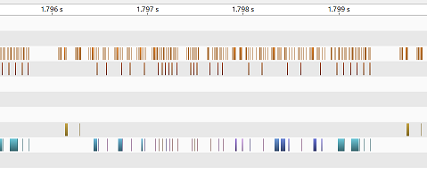
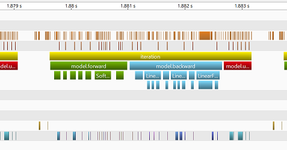
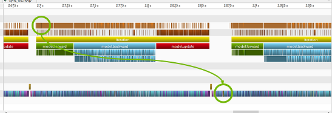
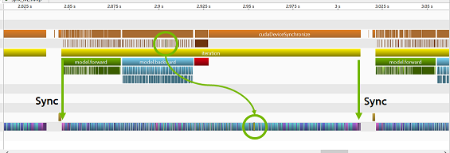
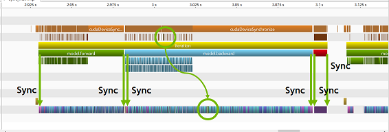
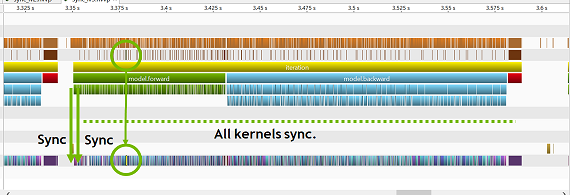

# chainer_profutil

This is an UNOFFICIAL Chainer related tool. This tool helps you to find forward, backward and update part from profiling details when you use NVIDIA Visual Profiler ([https://developer.nvidia.com/nvidia-visual-profiler](https://developer.nvidia.com/nvidia-visual-profiler) / [https://docs.nvidia.com/cuda/profiler-users-guide/index.html](https://docs.nvidia.com/cuda/profiler-users-guide/index.html)). As a result, you can improve your workload more efficiently.

## How to use.

1. Change your code according to example codes below
2. Run your code via `nvprof` (eg. `nvprof -o prof.nvvp python main.py ...`)
3. Load `prof.nvvp` to NVIDIA Visual Profiler `nvvp`
4. Enjoy your profiling and accelerating!

### To track all child processes when using ChainerMN and/or `MultiprocessParallelUpdater`.

Additional option, `--profile-child-processes`, makes it to track all child processes.
In addition, the profiler adds each process ID into the file name by using `%p` like `prof%p.nvvp`.

## Simple example.

Adding 2 lines is all you need. First, import a function. Second, call it.

### Before.

```python
optimizer = chainer.optimizers.Adam(alpha=0.001)
optimizer.setup(model)
```

[](./docs/imgs/profiling_example_without_mark.png)

### After.

```python
from chainer_profutil import create_marked_profile_optimizer

optimizer = create_marked_profile_optimizer(
    chainer.optimizers.Adam(alpha=0.001), sync=True, sync_level=2)
optimizer.setup(model)
```

[](./docs/imgs/profiling_example_with_mark.png)

## Example for ChainerMN.

When you use ChainerMN's `create_multi_node_optimizer()`, you need to give an instance returned from `create_multi_node_optimizer()` to `create_marked_profile_optimizer()` as follows.

```python
optimizer = create_marked_profile_optimizer(
    chainermn.create_multi_node_optimizer(
        chainer.optimizers.MomentumSGD(lr=0.01, momentum=0.9),
        comm),
    sync=False)
optimizer.setup(model)
```

## Profiling tips.

### Reducing the number of iterations.

A training script usually runs training procedure at multiple epochs.
But, the size of `nvprof` output becomes large if the training runs for long hours.

Therefore, we strongly recommend that you add an additional option to your code corresponding to the number of iterations.
If this iteration option is given, then a script stops by the given iteration instaed of epochs.
By this change, we can get relatively small profiling output and operate it by NVIDIA Visual Profiler.

### Synchronization level.

This tool has 3 synchronization levels and sync/async switch. Each level corresponds to each marker.
When you disable synchronize mode (ie., `sync=False`), then all markers don't synchronize all GPU kernels as below.

[](./docs/imgs/async.png)

When you enable synchronize mode (ie., `sync=True`), then some markers synchronize corresponding GPU kernels and other markers are asynchronous.

At level 1 (ie., `sync_level=1`), highest marker only synchronizes at the being and end of 1 iteration.

[](./docs/imgs/sync_lv1.png)

At level 2 (ie., `sync_level=2`), forward/backward/update markers synchronize at the begin and end of corresponding kernels.

[](./docs/imgs/sync_lv2.png)

On level 3 (ie., `sync_level=3`), all markers synchronize corresponding kernels.

[](./docs/imgs/sync_lv3.png)
